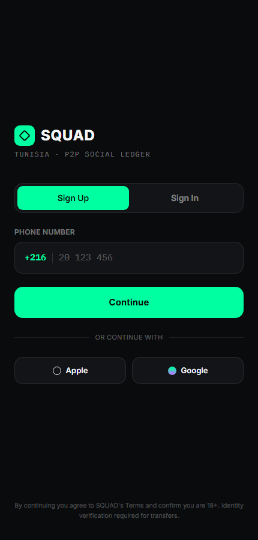
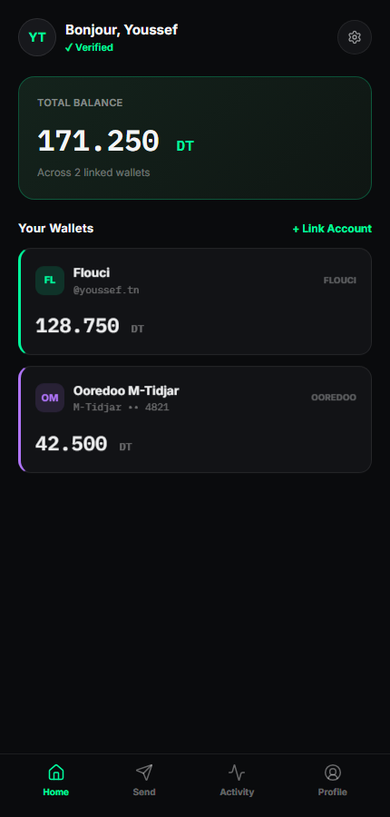
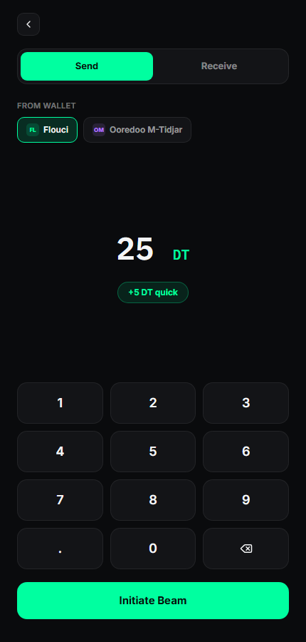
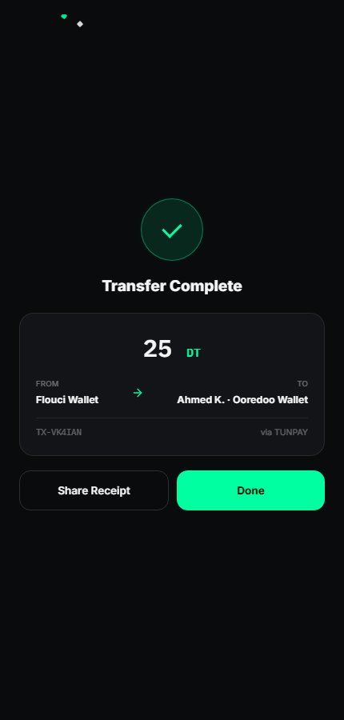

# SQUAD

**All your wallets. One way to pay.**

SQUAD is a P2P social ledger for Tunisia. Link the mobile money and e-payment
wallets you already have — Flouci, Ooredoo M-Tidjar, e-Dinar/BIAT
(ClicToPay), Walletii — into a single account, and send or receive money
instantly with anyone, regardless of which wallet either side is on.

<p align="center">
  
  
  
  
</p>

## The problem

Mobile wallets in Tunisia are siloed. If you use Flouci and a friend uses
Ooredoo M-Tidjar, you can't send them money directly — you're stuck with
cash, a bank transfer, or asking them to also get your wallet. Every wallet
is its own island, and users end up juggling three or four apps just to stay
reachable by everyone they know.

## What SQUAD does

SQUAD sits on top of the wallets you already have instead of replacing them:

- **Link every wallet you use, once.** Flouci, Ooredoo M-Tidjar, e-Dinar/BIAT,
  Walletii — connect them all to one SQUAD identity.
- **One balance, one ledger.** See your total balance across every linked
  wallet, and every send/receive in a single activity feed, instead of
  checking N separate apps.
- **Send P2P from any linked wallet, to anyone.** Pick the source wallet,
  enter an amount, and beam it to a nearby device over an encrypted
  ultrasonic handshake — no IBANs, no "do you have Flouci too?" The recipient
  gets the funds regardless of which wallet they're set up with.
- **KYC once, not per-wallet.** A single identity check (national ID +
  liveness, via Didit) unlocks transfers across every linked wallet at once.

## Why now

This only works because the wallets themselves are no longer siloed at the
infrastructure level: **BCT (Banque Centrale de Tunisie)** and **SMT
(Société Monétique Tunisie)** built **TUNPAY**, the national interoperable
instant-payment switch that lets money move between different wallets and
banks under one regulated, authorized rail. Before TUNPAY, cross-wallet P2P
required bilateral deals between every pair of providers — impractical to
scale. Now that interoperability is a legal, central-bank-backed utility,
SQUAD's job is simply to be the best consumer-facing layer on top of it: one
identity, one balance, one way to pay, no matter which wallet either side of
the transaction is actually holding the money in.

## Status

This is a fully interactive, end-to-end prototype of the product experience
— auth, wallet linking, KYC, and the full send/receive transfer flow all
work and are navigable today. The backend is currently mocked (in-memory,
client-side state simulating network/verification delays); wiring it to
Didit, TUNPAY, and the wallet providers for real is the next milestone. See
[docs/06-conventions.md](docs/06-conventions.md#server-actions) for exactly
what's mocked and where real integrations would plug in.

## Getting started

```bash
pnpm install
pnpm dev
```

Open [http://localhost:3000](http://localhost:3000).

```bash
pnpm build   # production build (Turbopack + Serwist service worker)
pnpm start   # serve the production build
pnpm lint
pnpm typecheck
```

## Documentation

Full technical specs — tech stack, architecture, PWA setup, conventions, and
an agent-guardrails checklist for anyone (human or AI) working in this repo
— live in [docs/](docs/README.md). Start there before making structural
changes.
